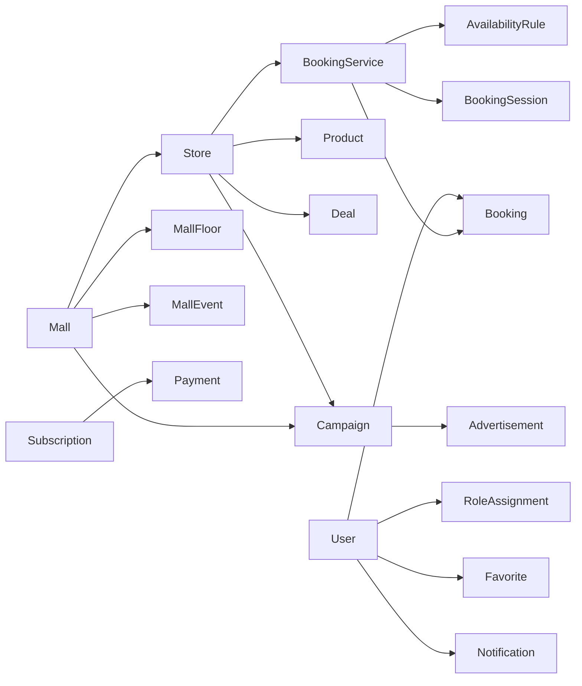

# Shopymalls Data Models

Status: POC domain baseline  
Version: 0.1  
Languages: Indonesian and English  
Currency: Indonesian rupiah (`IDR`)

## Source and scope

The models in `src/models/` are based on the delivered Supabase schema, feature screens, and Step 14.17 booking prototype. They are plain TypeScript and do not depend on Expo, a database, or an authentication provider.

For the POC, screens can use typed dummy objects in memory. Later, the same interfaces can be mapped to database tables or API responses without redesigning the domain first.

## Domain map

The main model groups are:

- `common.ts`: IDs, timestamps, localized copy, IDR money, opening hours, addresses, and media.
- `user.ts`: user profiles, localized shopping interests, notification preferences, and scoped role assignments; it intentionally contains no authentication credentials or sessions.
- `catalog.ts`: malls, floors, facilities, stores, categories, products, deals, and events.
- `booking.ts`: the eight delivered booking types, services, schedules, fixed sessions, business settings, and customer bookings.
- `engagement.ts`: favorites and notifications.
- `marketing.ts`: campaigns, advertisements, and analytics events.
- `billing.ts`: plans, subscriptions, and IDR payments.
- `authorization.ts`: permissions and local POC authorization helpers.

## Modeling decisions

- All IDs are strings so the POC may use readable dummy IDs now and UUIDs later.
- Dates and times are ISO strings at the model boundary. Mall and booking models carry an IANA time zone such as `Asia/Jakarta`.
- User-visible editorial copy is `{ id, en }`. English is the default value and Indonesian is the supported secondary value.
- Money is an integer number of whole rupiah and the only allowed currency is `IDR`; floating-point prices are not permitted by the contract.
- Role assignments are separate from the user profile and are scoped to self, a store, a mall, or the whole platform. One user may therefore work for multiple businesses without receiving global access.
- Booking covers recurring slots and fixed sessions. This supports tables, salon/barber/spa appointments, cinema or event tickets, entertainment activities, and fitness sessions from the delivered demo.

## Roles and authorization

Every active user can browse public content and manage their own profile, favorites, notifications, and bookings. Business access is additive and scoped.

| Role | Scope | Authorization |
|---|---|---|
| Shopper | Self | Browse active content and manage only their own profile, saved items, notifications, and bookings. |
| Retailer staff | One store | Operate products, deals, events, and bookings for that store. Cannot change staff, billing, campaigns, analytics access, or booking configuration. |
| Retailer admin | One store | All retailer-staff actions plus store profile, staff, booking configuration, campaigns, analytics, and billing for that store. |
| Mall admin | One mall | Manage the mall profile, floors, staff, events, campaigns, analytics, billing, tenant review, and featured/moderated deals inside that mall. Cannot edit a retailer's products or staff. |
| Platform admin | Platform | Manage users, malls, stores, moderation, global analytics, pilot controls, testing, and billing across Shopymalls. |

The delivered schema's `retailer` role maps to `retailer_admin` when `store_staff.is_owner` is true and to `retailer_staff` otherwise. The delivered `shopymalls_admin` role maps to `platform_admin`.

Pending users can browse public content and read their own profile while awaiting approval. Blocked users receive no authorization.

The `can`, `canAny`, and `canAll` helpers are suitable for deciding which POC tabs and actions to display. They are not a security boundary. When persistence and authentication are introduced, these rules must also be enforced in the backend or database row-level policies.
